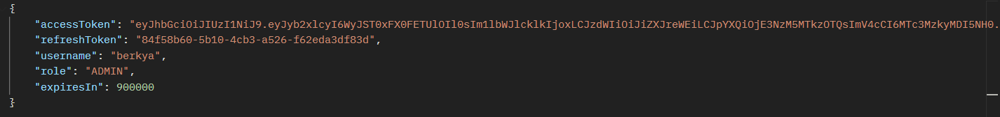
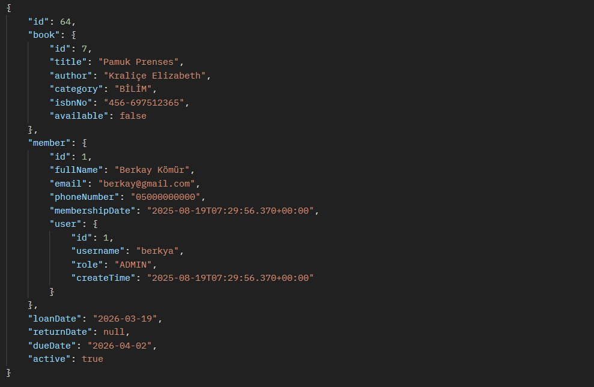
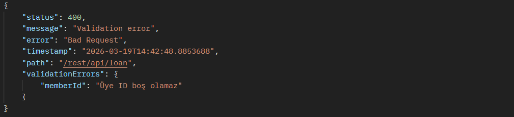
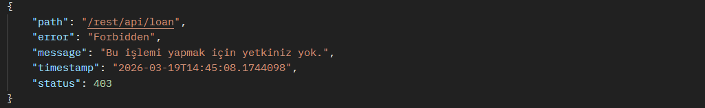

# 📚 Library Management System (Spring Boot)
A secure and production-ready **Library Management System** built with Spring Boot.
This project demonstrates **JWT-based authentication**, **role-based authorization**, and a clean **layered REST API architecture**.

---

## 🚀 Features
* 🔐 JWT-based Authentication & Authorization
* 👥 Role-based Access Control (ADMIN, USER)
* 📖 Book Management 
* 🧑 Member Management
* 🔄 Loan System (Borrow / Return books)
* ♻️ Refresh Token Mechanism
* 🧩 Global Exception Handling
* 🏗 Clean Layered Architecture (Controller → Service → Repository)
* 📦 DTO-based Data Transfer
* 🛡 Spring Security Integration

### 🧪 Testing
* ✅ **Unit Tests** → Business logic tested with JUnit 5 & Mockito
* 🔐 **Integration Tests** → End-to-end testing of secured API endpoints
---

## 🏛 Project Architecture
The project follows a clean and maintainable layered architecture:


---

## 📂 Package Structure

* `config` → Security & application configuration
* `controller` → REST API endpoints
* `dto` → Data Transfer Objects
* `enums` → Role definitions
* `exception` → Custom exception classes
* `handler` → Global exception handling
* `jwt` → JWT filter & token service
* `mapper` → DTO ↔ Entity mapping
* `model` → Entity classes
* `repository` → JPA repositories
* `service` → Business logic layer

---

## 🔐 Authentication Flow

1. User registers
2. User logs in
3. Server returns:

   * Access Token (JWT)
   * Refresh Token
4. Access token is used for protected endpoints
5. When expired → Refresh token generates a new access token

Security configuration includes:

* `SecurityConfig`
* `JwtAuthenticationFilter`
* `JwtService`
* `CustomUserDetails`

---

## 🧠 Roles & Authorization

### ADMIN

* Full access to almost all endpoints

### USER

* Limited access
* Can only access their own data

**Example:**

```java
@PreAuthorize("hasRole('ADMIN') or #request.memberId == authentication.principal.memberId")
```

---

## 📚 Core Modules

### 📖 Book
* Create book
* Update book
* Delete book
* List all books

### 🧑 Member
* Register member
* Update member
* List members

### 🔄 Loan
* Borrow book
* Return book
* Track active loans

---

## 🛠 Technologies Used
* Java 17+
* Spring Boot
* Spring Security
* Spring Data JPA
* JWT
* Maven
* PostgreSQL (configurable)

---

## ⚙️ How to Run

### 1️⃣ Clone the repository
```bash
git clone https://github.com/berkya0/Library-Management-System.git
```

### 2️⃣ Configure Database
Update `application.properties`:

```
spring.datasource.url=jdbc:postgresql://localhost:5432/library
spring.datasource.username=your_username
spring.datasource.password=your_password
```

### 3️⃣ Run the project
```
./mvnw spring-boot:run
```
or
```
mvn spring-boot:run
```

---

## 🧪 API Testing
You can test the API using:

* **Postman** → For sending HTTP requests (GET, POST, PUT, DELETE)
* **Browser** → For basic authentication flows
  
## 📸 API Usage Examples

### 🔐 Authentication – Login
Authenticate the user and retrieve JWT tokens.

**Request**

```json
{
  "username": "berkya",
  "password": "password123"
}
```
**Response** 





---
### 🔒 Borrow Book 
Borror book using a valid access token.

**Request**

```json
{
   "bookId": 7,
   "memberId": 1
}
```
**Response** 




---

### ❌ Error Handling Example

Example of validation or authorization error response.

**Request**

```json
{
  "memberId": null,
  "bookId": 5
}
```

**Response** 





**Request**
Not: This member id does not belong current member
```json
{
  "memberId": 5, 
  "bookId": 5
}
```

**Response** 




### Authentication
- POST /rest/api/user/register
- POST /rest/api/authenticate
- POST /rest/api/refresh-token

### USER
- PUT /rest/api/user/update
- DELETE /rest/api/user/delete/{userId}

### Book
- GET /rest/book/get/{bookId}
- GET /rest/api/book/get/list
- POST /rest/api/book/save (ADMIN)
- DELETE /rest/api/book/delete/{bookId} (ADMIN)

### Loan
- POST /rest/api/loan
- GET /rest/api/loan/my-loans
- POST /rest/api/loan/return/{loanId}
- GET /rest/api/loan/all

### Member
- GET /rest/api/member/get/{memberId}
- PUT /rest/api/member/update/{memberId}
- GET /rest/api/member/get/list
- GET /rest/api/member/me
- PUT //rest/api/member/update-role/{memberId}
  
---

## 🎯 What I Practiced

* Designing a secure REST API architecture
* Implementing JWT authentication from scratch
* Building a refresh token mechanism
* Applying role-based & ownership-based authorization
* Structuring scalable layered architecture
* Implementing global exception handling
* Using DTOs for clean API design
* Securing endpoints with method-level authorization

---

## 👨‍💻 Author

**Berkay Kömür**
Computer Engineering Student | Java & Spring Boot Developer 🚀
